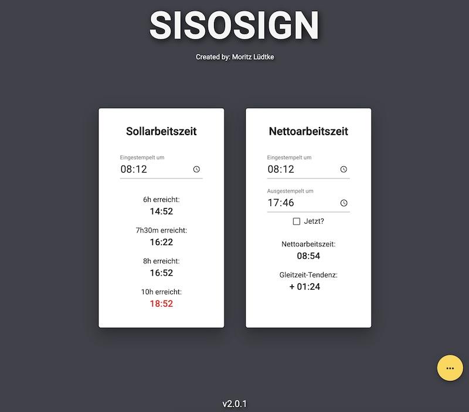

# SISOSIGN

Developed by Moritz Lüdtke

SISOSIGN is a work time calculator on the web. It is intentionally designed for the german market.

Enjoy it in its full glory [right here](https://sisosign.de/).

## Local Development
- `npm run serve` or `ng serve` runs it locally

### Update Angular Version via Angular CLI

#### Preferred

https://update.angular.io/

#### May also work

Run the `./update-angular.sh` script.

## Trivia

1. If you want to know what SISOSIGN stands for you have to take a look at the source code, look carefully through the ui or ask a die hard fan ;)
2. SISOSIGN probably has more users than the developer assumes.

## Credits

- [Pure CSS Firworks from Eddie Lin (CodePen Link)](https://codepen.io/yshlin/pen/ylDEk)
